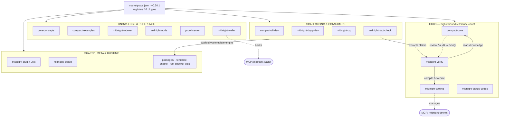

# Architecture

Documentation for how the **midnight-expert** repository is put together — what
the pieces are, how they fit, and why. If you're contributing to a plugin,
adding a skill, or trying to understand how a `/verify` run actually works, start
here.

- [Overview](#overview) — the mental model
- [Architecture diagram](#architecture-diagram) — the system at a glance
- [Repository layout](#repository-layout) — where things live on disk
- [The building blocks](#the-building-blocks) — plugins, skills, agents, commands, hooks
- [The plugin families](#the-plugin-families)
- [How the pieces cooperate](#how-the-pieces-cooperate)
- [Hooks](./hooks.md) — the session-lifecycle automation, in detail

---

## Overview

**midnight-expert** is a **marketplace of [Claude Code plugins](https://docs.anthropic.com/en/docs/claude-code/plugins)**
for developers building on the [Midnight Network](https://midnight.network/). It
is not an application you run — it's a collection of knowledge, tooling, and
automation that installs *into* Claude Code and makes the model a competent
Midnight/Compact developer.

Everything hangs off a single root manifest, [`.claude-plugin/marketplace.json`](../.claude-plugin/marketplace.json),
which registers **16 plugins**. Each plugin is a self-contained directory under
[`plugins/`](../plugins/) that ships some combination of five artifact types:
**skills**, **agents**, **slash commands**, **hooks**, and reference documentation.

The whole suite is organized around one hard-won principle:

> **A model's recalled knowledge about Midnight and Compact is unreliable and is
> outpaced by frequent breaking changes.** Treat it as suspect and *verify*.

That principle shapes the architecture. Rather than trusting the model to
remember Compact syntax or SDK signatures, the plugins supply vetted, dated
reference material (skills), give the model tools to **mechanically prove**
claims by compiling and executing code (`midnight-verify`, `midnight-fact-check`),
and use **hooks** to inject freshness warnings and nag until unverified code has
actually been checked. See [hooks.md](./hooks.md) for how that last part works.

At a glance the repo contains:

| Artifact | Count |
| --- | --- |
| Plugins | 16 |
| Skills | 88 |
| Slash commands | 14 |
| Agents | 17 |

(Skills + slash commands are often quoted together as **102** user-facing capabilities.)

---

## Architecture diagram

The map below groups the 16 plugins by role and shows the main dependencies
between them. Edges labelled with a count (e.g. `/verify ×70`) are **grep-derived
counts of documented cross-references** in the repo — how often one plugin points
users at another — not a runtime call graph. MCP servers are wired in
out-of-band by the developer, not declared in the marketplace manifest.



A fuller, interactive version of this diagram is maintained as a
[Claude Artifact](https://claude.ai/artifact/A5waktGJv67AfFgPCaeU5Q).

---

## Repository layout

```
midnight-expert/
├── .claude-plugin/
│   └── marketplace.json        # root manifest — registers all 16 plugins
├── plugins/                    # one directory per plugin
│   └── <plugin>/
│       ├── .claude-plugin/
│       │   └── plugin.json      # plugin manifest (name, version, metadata)
│       ├── skills/              # SKILL.md + references/, one dir per skill
│       ├── agents/              # subagent definitions (one .md per agent)
│       ├── commands/            # slash commands (one .md per command)
│       ├── hooks/
│       │   └── hooks.json       # lifecycle-event → command bindings
│       ├── scripts/             # shell scripts invoked by hooks & commands
│       ├── assets/              # mascot / banner images
│       └── README.md
├── packages/                   # shared TypeScript packages (not plugins)
│   ├── template-engine/         # scaffolding engine used by the "-dev" plugins
│   └── midnight-fact-checker-utils/
├── scripts/                    # repo-level validation & CI helpers
│   ├── validate-marketplace.sh
│   ├── validate-plugin.sh
│   └── ci/
├── architecture/               # ← you are here (this documentation)
└── README.md                   # user-facing marketplace README
```

---

## The building blocks

A plugin is assembled from up to five artifact types. Understanding what each one
*is* — and, crucially, *who executes it* — is the key to reading this repo.

| Artifact | Lives in | Executed by | Purpose |
| --- | --- | --- | --- |
| **Skill** | `skills/<name>/SKILL.md` (+ `references/`) | The **model**, on demand | Vetted, dated reference knowledge the model loads when a task matches. The bulk of the repo. |
| **Agent** | `agents/<name>.md` | The **model** (as a subagent) | A specialized sub-persona with its own tools and prompt — e.g. the seven `midnight-verify` agents that each prove a different kind of claim. |
| **Slash command** | `commands/<name>.md` | The **model**, when the user types `/…` | A named, repeatable workflow (`/verify`, `/devnet`, `/lookup`). |
| **Hook** | `hooks/hooks.json` → `scripts/…` | The **harness** (not the model) | Shell commands run automatically at fixed points in the session lifecycle. Reliable regardless of what the model decides. See [hooks.md](./hooks.md). |
| **Reference docs** | `references/*.md` under each skill | Read by the model | The long-form source material a skill pulls from. |

The distinction that matters most: **skills, agents, and commands are things the
model chooses to invoke; hooks are things the harness runs whether the model
likes it or not.** That's why hooks are the backbone of the "don't trust your
memory, verify" enforcement.

---

## The plugin families

The 16 plugins fall into six functional groups (mirroring the sections of the
top-level [README](../README.md)).

### Smart contract development
- **compact-core** — the central knowledge hub for writing Compact: contract
  structure, types, ledger declarations, circuits, witnesses, privacy/disclosure
  rules, tokens, circuit costs, debugging, and code review.
- **compact-examples** — compilable example contracts (beginner → full apps),
  all pinned to `pragma language_version 0.23`.
- **compact-cli-dev** — scaffolds and develops Oclif CLIs for Compact contracts.

### DApp development
- **midnight-dapp-dev** — scaffolds and builds Midnight DApp frontends
  (Vite + React + shadcn + Tailwind), wallet integration, provider architecture.

### Testing & code quality
- **midnight-cq** — linting, formatting, type checking, contract/DApp/ledger/wallet
  testing, Git hooks, and CI workflows.
- **midnight-verify** — the verification framework. Compiles and executes Compact,
  type-checks SDK code, runs ZKIR through the WASM checker, cross-checks witnesses,
  and inspects compiler/ledger/wallet source. A multi-agent pipeline behind `/verify`.
- **midnight-fact-check** — extracts testable claims from content, classifies them
  by domain, and verifies each one via `midnight-verify`.

### Toolchain & infrastructure
- **midnight-tooling** — installs and manages the Compact CLI, the local devnet,
  compiler version switching, diagnostics, and release notes.
- **midnight-wallet** — Wallet SDK reference, test-wallet management, SDK
  regression checking.
- **midnight-status-codes** — a catalog and lookup for every Midnight error/status
  code across the whole stack.

### Knowledge & education
- **core-concepts** — conceptual foundations: architecture, data models, privacy
  patterns, protocols (Kachina, Zswap), tokenomics, zero-knowledge proofs.

### Network & component references
- **proof-server**, **midnight-indexer**, **midnight-node** — deep reference for
  each network component.

### Meta & shared
- **midnight-expert** — ecosystem diagnostics (`/doctor`) and the reminder-delivery
  hook (see [hooks.md](./hooks.md)).
- **midnight-plugin-utils** — audits and resolves cross-plugin dependencies.
- **packages/** — shared TypeScript packages (`template-engine`,
  `midnight-fact-checker-utils`) that the plugins build on. These are libraries,
  not plugins, so they aren't registered in the marketplace.

---

## How the pieces cooperate

Three cooperation patterns are worth internalizing:

1. **Knowledge → verification.** The "-dev" and reference plugins point users at
   `midnight-verify` whenever code or a claim needs to be *proven* rather than
   trusted. `midnight-verify` in turn reads `compact-core`'s knowledge and uses
   `midnight-tooling` to actually compile and execute. `midnight-fact-check` sits
   on top, feeding extracted claims into the same verification pipeline.

2. **Scaffolding → shared engine.** The scaffolding plugins (`compact-cli-dev`,
   `midnight-dapp-dev`) don't each reimplement project generation; they call into
   the shared `template-engine` package under `packages/`.

3. **The hooks self-correction loop.** `compact-core` and `midnight-expert` hooks
   cooperate across plugin boundaries through a shared per-session state file to
   catch uncompiled `.compact` code and nag the developer to verify it before
   trusting any claim. This is the most load-bearing runtime interaction in the
   repo and has its own document: **[hooks.md](./hooks.md)**.

MCP servers (`midnight-wallet`, `midnight-devnet`) extend the runtime further but
are wired in by the developer out-of-band — they are not part of the marketplace
manifest.
