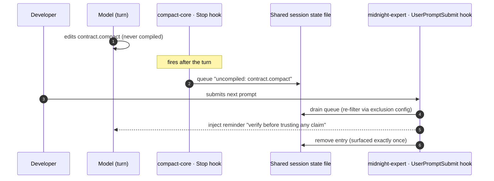

# Claude Code Hooks in midnight-expert

> How the `midnight-expert` plugin suite uses Claude Code hooks. This is the
> single most load-bearing runtime interaction in the repo — if you touch any
> `hooks/` or `scripts/hooks/` file, read this first.
>
> *Adapted from the internal "Claude Code Hooks in midnight-expert" note
> (Correctness & Freshness Audit, 2026-09) and re-verified against the current
> tree.*

## What hooks are

Hooks are Claude Code's mechanism for running project-defined shell commands
automatically at fixed points in a session's lifecycle. The **harness — not the
model — executes them**, so they are a reliable way to inject context, enforce
policy, and trigger side effects regardless of what the model chooses to do.

Each plugin declares them in a `hooks/hooks.json` that binds a **lifecycle
event** to a **command**, with:

- a **`matcher`** — which event instances it applies to (`*` for all, or an exact
  name such as a subagent's identifier),
- a **`command`** — the shell command to run,
- a **`timeout`** — and optionally `async: true` for fire-and-forget cleanup.

`${CLAUDE_PLUGIN_ROOT}` expands to the plugin's install path, so a hook always
resolves its own scripts regardless of where the plugin is installed.

## Why the suite leans on them

The suite leans on hooks to fight one core problem:

> **The model's recalled knowledge about Midnight/Compact is unreliable and is
> outpaced by frequent breaking changes.**

Hooks inject freshness warnings, detect unverified Compact code, and nag until
it's verified — catching confidently-wrong answers before they reach the
developer. **Three plugins** define hooks, cooperating through a shared
per-session state file.

| Plugin | Events used | Role |
| --- | --- | --- |
| **compact-core** | `SessionStart` (×2), `Stop`, `SessionEnd` | Version/freshness context; detects uncompiled `.compact` files at end of turn |
| **midnight-expert** | `UserPromptSubmit` | Surfaces queued reminders on the next prompt |
| **midnight-verify** | `SessionStart`, `SubagentStop` (×7) | Verification context + per-verify-agent post-processing |

## Each area, in detail

### compact-core — the freshness + compile watchdog

- **`SessionStart`** runs two scripts. `SessionStart.sh` injects the "active
  development / verify versions / don't trust memory" context; a second script,
  `SessionStart-compact-check.sh`, runs a compiler-version check (the source of
  the version banner you see at session start) and snapshots the current
  `.compact` file hashes as the baseline. Both are designed to *never* fail the
  session — they fall through to a clean exit if anything goes wrong.
- **`Stop`** runs after every model turn, detecting `.compact` files changed but
  not compiled this session. It either **blocks** the turn (gated by a
  5-trigger + 2-hour cooldown so it can't nag endlessly) or **defers** by queuing
  the file list into the shared per-session state file for later surfacing.
- **`SessionEnd`** performs cleanup asynchronously (`async: true`), persisting any
  still-unchecked files.

### midnight-expert — the reminder delivery

- **`UserPromptSubmit`** drains this session's queue and surfaces reminders
  (e.g. *"these Compact contracts were never compiled — verify before trusting
  any claim"*) exactly once, on the next prompt. It re-filters the files through
  the current exclusion config and **never blocks prompt submission**.

### midnight-verify — verification lifecycle

- **`SessionStart`** adds verification-oriented context.
- **`SubagentStop`** with **seven exact-name matchers** — one per verify agent
  (`contract-writer`, `source-investigator`, `type-checker`, `cli-tester`,
  `sdk-tester`, `witness-verifier`, `zkir-checker`) — post-processes each verify
  agent as it finishes.

## The cooperative loop (most important detail)

The two most commonly-fired hooks form a **self-correction loop across plugin
boundaries**:

1. **`compact-core` `Stop`** — after a turn, finds `.compact` files touched but
   not compiled → **queues** an entry into the shared per-session state file.
2. **`midnight-expert` `UserPromptSubmit`** — on the developer's next prompt,
   **drains** that queue, surfaces the reminder as additional context, then
   removes it so it appears exactly once.



### Design guarantees worth knowing

- **Non-blocking safety** — the `UserPromptSubmit` and `SessionStart` scripts
  always fall through to a clean `exit 0` on any failure path. A broken hook can
  never block prompt submission or session start.
- **Per-session isolation** — state is keyed by project + session id; a sibling
  session's state file is never touched.
- **Config-aware** — queued file lists are re-filtered through the current
  exclusion config *at delivery time* (the config may have changed since queuing).
- **Escalation** — repeated uncompiled-contract flags add escalation text
  pointing at the reset / exclude scripts.

## State & configuration

- **Per-session state file:** `$HOME/.midnight-expert/state/<project-hash>/<session-id>.json`
  — a JSON document holding the schema version, the baseline `.compact` file
  hashes, and the pending reminder queue. Both plugins read and write it through
  the shared `_compact-check.sh` helper library.
- **Per-project config:** `.claude/compact-check.json` in the working project —
  controls which files are excluded from the uncompiled-contract check.
- **Manual controls (compact-core):**
  - `scripts/compact-check-reset.sh` — reset the session's check state.
  - `scripts/compact-check-exclude.sh` — add a file/pattern to the exclusion config.

## Key files

```
plugins/compact-core/
├── hooks/hooks.json                        # SessionStart ×2, Stop, SessionEnd
└── scripts/
    ├── SessionStart.sh                      # freshness / "don't trust memory" context
    ├── compact-check-reset.sh               # manual: reset check state
    ├── compact-check-exclude.sh             # manual: exclude a file/pattern
    └── hooks/
        ├── SessionStart-compact-check.sh    # version check + baseline snapshot
        ├── Stop.sh                          # detect uncompiled .compact → block/defer
        ├── SessionEnd.sh                    # async cleanup
        ├── _compact-check.sh                # shared state/exclusion helper library
        └── tests/                           # bats-style hook test suite

plugins/midnight-expert/
└── scripts/hooks/
    ├── UserPromptSubmit.sh                  # drain queue, surface reminders once
    └── _compact-check.sh                    # shared helper (mirror of compact-core's)

plugins/midnight-verify/
├── hooks/hooks.json                         # SessionStart + SubagentStop ×7
└── scripts/hooks/
    ├── SessionStart.sh
    └── subagent-stop-<agent>.sh             # one per verify agent (×7)
```

> **Note:** `compact-core` ships a substantial hook test suite under
> `scripts/hooks/tests/` (blocking/cooldown/escalation, drain-respects-exclusions,
> per-session isolation, staleness, GC, …). If you change hook behavior, run and
> extend those tests.
